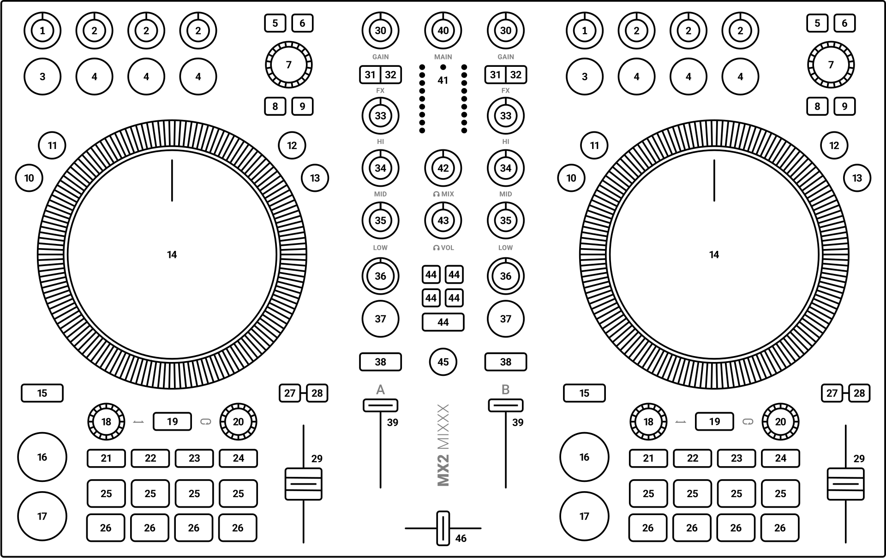

# Traktor MX2 Mixxx mapping

This repository contains an improved Native Instruments **Traktor MX2** mapping for [Mixxx](https://www.mixxx.org) (version 2.6 or higher). New features include expanded effect controls, sampler pads, user configurable settings and customizable LED color themes.

## Controller overview

## Mapping description

Most knobs and buttons function as they are labeled and follow the manufacturer's original mapping where applicable. Mixxx's [standard controls](https://manual.mixxx.org/2.6/en/chapters/effects#controller-effects-mapping) are used for the top row effect knobs (**2**), the effect focus buttons (**3**) and for the effect toggle (**4**) buttons.

### Decks (1–29)

| No. | Element | Primary function | Secondary function |
| --- | --- | --- | --- |
| 1 | FX main knob | Control FX chain dry / wet balance ||
| 2 | FX param knob | 
**Normal mode:** Control FX meta parameter

**Focus mode:** Adjust focused effect parameter
 ||
| 3 | FX focus button | 
*Press* to toggle FX parameter panel

*Hold* to enter effect focus select mode ||
| 4 | FX toggle button | 
**Normal mode:** Toggle effect on / off

**Focus select mode:** Choose focused effect

**Focus mode:** Toggle focused effect parameter on / off
 | Cycle through effects |
| 5 | FAV button | Use next color for selected track | Use previous color for selected track |
| 6 | Star button | Add track to Auto DJ queue (bottom) | Add track to Auto DJ queue (top) |
| 7 | Browse encoder | 
*Press* to load selected track

*Turn* to scroll through items in tracks listing
 | 
*Press* to enter to select the active sidebar item

*Turn* to scroll through items in library sidebar
 |
| 8 | Preview button | Load and play / pause track in preview deck ||
| 9 | VIEW button | Toggle big library mode ||
| 10 | REV button | *Hold* to play track in reverse | *Hold* for reverse play with slip mode |
| 11 | FLX button | Toggle slip mode on / off ||
| 12 | TT button | Set jogwheel to turntable mode ||
| 13 | JOG button | Set jogwheel to jog mode ||
| 14 | Jog wheel | 
*Touch* the top of the jog wheel and turn it to scratch

*Turn* the jog wheel from the edge to nudge the track
 | *Turn* the jog wheel to seek quickly while stopped |
| 15 | SHIFT button | Activates secondary functions when held ||
| 16 | PLAY button | Toggle track playback | Go to track start and stop |
| 17 | CUE button | Set default cue point | Jump to cue point and stop |
| 18 | Move encoder | 
*Press* and *hold* to activate a rolling loop of the defined number of beats. Once released, playback will resume from the original position.

*Turn* to beatjump backwards / forwards

**Stems mode:** *Turn* to control stem track volume while pad 5–8 is held
 | *Press* to activate and jump to current loop while stopping playback |
| 19 | Keylock button | 
*Press* to toggle keylock

*Hold* and turn loop encoder (**20**) to change track pitch
 ||
| 20 | Loop encoder | 
*Press* to set and enable a loop of the defined number of beats

*Turn* to halve or double loop size

*Turn* while *holding* keylock (**19**) to adjust track pitch

**Stems mode:** While *holding* pad 5–8 (**26**) *turn* to adjust stem track FX super knob
 | 
*Press* to toggle current loop on / off

**Stems mode:** While *holding* pad 5–8 (**26**) *turn* to select a stem Quick FX preset
 |
| 21 | Hotcues button | Activate **hotcues** pad mode ||
| 22 | Stems button | Activate **stems** pad mode ||
| 23 | Samples button | Activate **samples** pad mode ||
| 24 | Loops button | Activate **loops** pad mode ||
| 25 | Pad buttons 1–4 | 
**Hotcues mode:** Seek to a set hotcue position. Otherwise set hotcue at the current position.

**Stems mode:** Toggle stem track mute

**Samples mode:** Play loaded sampler track. If the sampler is empty, load the selected track.

**Loops mode:** *Hold* to enable a rolling loop of 1/16, 1/8, 1/4 or 1/2 beats
| 
**Hotcues mode:** Clear a set hotcue

**Samples mode:** Eject the currently loaded track

**Loops mode:** *Hold* to enable a default loop
 |
| 26 | Pad buttons 5–8 | 
**Hotcues mode:** Same as for pads 1–4 (**25**)

**Stems mode:** *Hold* to use as function modifiers for move (**18**) and loop (**20**) encoders.

**Samples mode:** Same as for pads 1–4 (**25**)

**Loops mode:** *Hold* to enable a rolling loop of 1, 2, 4 or 8 beats
 | 
**Hotcues mode:** Same as for pads 1–4 (**25**)

**Samples mode:** Same as for pads 1–4 (**25**)

**Loops mode:** *Hold* to enable a default loop
 |
| 27 | SNC button | 
*Press* to sync tempo and phase (if quantize is active)

*Hold* to activate sync lock and *press* again to disable it
 | Sync phase to the other deck |
| 28 | MST button | *Press* to set deck as the sync leader. *Hold* to enable / disable long range tempo fader. ||
| 29 | Tempo fader | Adjust playback speed ||

### Mixer deck columns (30–39)

| No. | Element | Function |
| --- | --- | --- |
| 30 | GAIN knob | Adjust deck pre-fader gain |
| 31 | Left FX button | Send deck output to FX unit 1 |
| 32 | Right FX button | Send deck output to FX unit 2 |
| 33 | HI knob | Adjust high frequency filter |
| 34 | MID knob | Adjust middle frequency filter |
| 35 | LOW knob | Adjust low frequency filter |
| 36 | Quick FX knob | Control Quick FX meta parameter |
| 37 | Quick FX button | Toggle Quick FX on / off |
| 38 | Headphone button | Toggle headphone cueing |
| 39 | Volume fader | Adjust deck volume |

### Center mixer column (40–46)

| No. | Element | Function |
| --- | --- | --- |
| 40 | MAIN knob | Adjust main output volume (hardware control) |
| 41 | Level meters | Show the current instantaneous deck volume |
| 42 | Headphone MIX knob | Adjust headphone cue / main mix |
| 43 | Headphone VOL knob | Adjust headphone output volume |
| 44 | Quick FX preset button | 
*Press* to load configured Quick FX preset to both decks

*Hold* and *press* a Quick FX toggle button (**37**) to load for a single deck only
 |
| 45 | MIC button | 
*Press* to toggle microphone talkover

*Hold* for momentary microphone activation |
| 46 | Crossfader | Adjust crossfader between decks |

## Mapping options

Mapping options can be accessed from *Options -> Preferences -> Controllers -> Traktor MX2*.

### Deck lighting

| Setting | Default | Description |
| --- | --- | --- |
| Color theme | Default | Color theme used for button LEDs. Select **Custom** to use colors defined in the **Custom theme colors** section. |
| Match pad colors to on-screen colors | On | Use on-screen colors for pad LEDs. This only applies to **hotcue** and **stem** modes. |
| Use bright VU meter segments | On | Use full brightness for VU meter LED segments. Dimmed LEDs will be used if disabled. |
| Enable bottom panel light effects | On | Use bottom panel LEDs to indicate deck state. Effect colors can be customized in the **Bottom panel colors** section. |

### Custom theme colors

| Setting | Default | Description |
| --- | --- | --- |
| Effect focus button | White | Color for the effect focus button |
| Effect toggle buttons | Orange | Color for effect on / off toggle buttons |
| Library buttons | White | Color for library action buttons |
| Transport buttons | Red | Color for transport mode buttons |
| Wheel mode buttons | Blue | Color for jog wheel mode buttons |
| Cue button | Blue | Color for the cue button |
| Play button | Green | Color for the play button |
| Keylock button | Yellow | Color for the keylock button |
| Inactive pad mode buttons | Sky | Color for inactive pad mode buttons |
| Active pad mode button | Celeste | Color for the active pad mode button |
| Unconnected pads | White | Color for unconnected pads. Used for unset hotcues, unloaded sampers and modifier pads. |
| Inactive pads | White | Color for connected, but currently inactive pads |
| Active pads | Green | Color for currently active pads |
| Alternate mode pads | Orange | Color for currently active pads in alternate mode. This includes looping samplers and pads activated while *holding* **Shift**. |
| Sync buttons | Magenta | Color for sync and sync master buttons |
| FX buttons | White | Color for Quick FX toggle buttons. Quick FX preset colors take preference over this setting. |
| Headphone buttons | White | Color for headphone cue buttons |
| Talkback button | White | Color for the talkback button |

### Bottom panel colors

| Setting | Default | Description |
| --- | --- | --- |
| Standby | White | Bottom panel LED color when no track is loaded |
| Playback state | Sky | Bottom panel LED color when a track is currently playing |
| Loop enabled | Green | Bottom panel LED color when a loop is currently active |
| Track ending | Red | Bottom panel LED color when the currently playing track is about to end |

### Quick FX colors

| Setting | Default | Description |
| --- | --- | --- |
| Button 1 | Red | Color for Quick FX preset button **1**
| Button 2 | Green | Color for Quick FX preset button **1**
| Button 3 | Blue | Color for Quick FX preset button **1**
| Button 4 | Yellow | Color for Quick FX preset button **1**
| Filter button | Orange | Color for **Filter** Quick FX preset button

### Quick FX presets

| Setting | Default | Description |
| --- | --- | --- |
| Button 1 | 1 | Quick FX chain to load when preset button **1** is pressed
| Button 2 | 2 | Quick FX chain to load when preset button **2** is pressed
| Button 3 | 3 | Quick FX chain to load when preset button **3** is pressed
| Button 4 | 4 | Quick FX chain to load when preset button **4** is pressed
| Filter button | 11 | Quick FX chain to load when **Filter** preset button is pressed

### Jog wheels

| Setting | Default | Description |
| --- | --- | --- |
| Jogging and nudging sensitivity | Medium | Sensitivity for turning the wheel by touching only the outer ring. Higher settings will allow for faster jogging and nudging movement. |
| Movement smoothing | Medium | Controls jog wheel movement smoothing. Low setting produces smooth but less responsive movement, while high setting produces snappy but noisier movement. |
| Input dead zone | Medium | Adjusts the jog-wheel input dead zone. Higher values ignore more subtle movements, but can make the wheel feel less responsive. |

### Controls

| Setting | Default | Description |
| --- | --- | --- |
| Use soft takeover for knobs and faders | On | Ignore knob and fader movements until they pass the current on-screen position. This can prevent sudden level jumps when physical and on-screen controls are out of sync. |
| Rate fader midpoint snapping | Off | Range over which rate faders automatically snap to the midpoint |

### Audio

| Setting | Default | Description |
| --- | --- | --- |
| Enable master gain | Off | Use Mixxx's master gain knob instead of sending audio directly to the output. |
